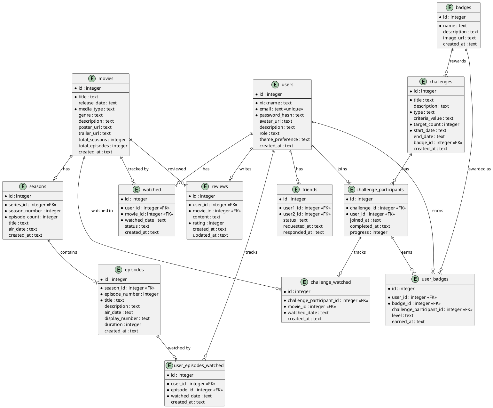
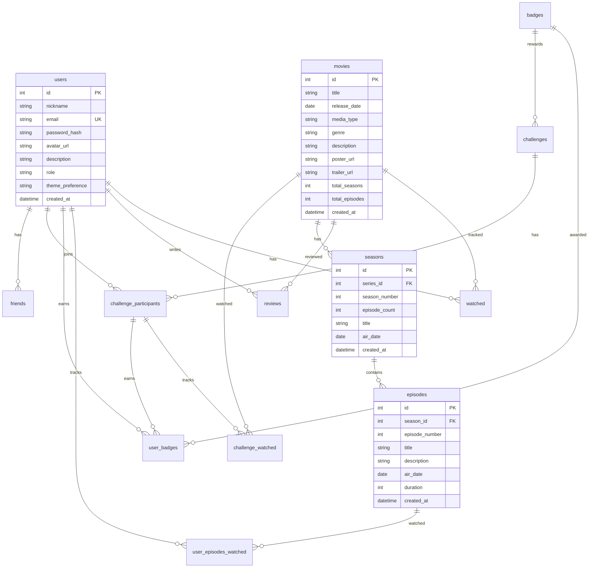

# 🗺️ Generowanie Diagramu Bazy Danych

Ten dokument opisuje jak wygenerować diagram ERD (Entity Relationship Diagram) dla bazy danych Movie Tracker.

## Metoda 1: dbdiagram.io (Najprostsza)

### Krok 1: Wejdź na https://dbdiagram.io

### Krok 2: Wklej poniższy kod DBML:

```dbml
// Movie Tracker Database Schema

Table users {
  id integer [primary key, increment]
  nickname text [not null]
  email text [unique, not null]
  password_hash text [not null]
  avatar_url text
  description text
  role text [note: 'admin or user']
  theme_preference text [note: 'light or dark']
  created_at text
}

Table movies {
  id integer [primary key, increment]
  title text [not null]
  release_date text
  media_type text [not null, note: 'movie or series']
  genre text
  description text
  poster_url text
  trailer_url text
  total_seasons integer [default: 1]
  total_episodes integer [default: 1]
  created_at text
}

Table seasons {
  id integer [primary key, increment]
  series_id integer [not null, ref: > movies.id]
  season_number integer [not null]
  episode_count integer [not null]
  title text
  air_date text
  created_at text
  
  indexes {
    (series_id, season_number) [unique]
  }
}

Table episodes {
  id integer [primary key, increment]
  season_id integer [not null, ref: > seasons.id]
  episode_number integer [not null]
  title text [not null]
  description text
  air_date text
  display_number text [note: 'Sxx - Eyyy formatted display number, optional; use triggers or backfill to populate']
  duration integer [default: 45]
  created_at text
  
  indexes {
    (season_id, episode_number) [unique]
  }
}

Table watched {
  id integer [primary key, increment]
  user_id integer [not null, ref: > users.id]
  movie_id integer [not null, ref: > movies.id]
  watched_date text [not null]
  status text [note: 'watched, watching, planning, dropped']
  created_at text
}

Table reviews {
  id integer [primary key, increment]
  user_id integer [not null, ref: > users.id]
  movie_id integer [not null, ref: > movies.id]
  content text
  rating integer [not null, note: '1-5']
  created_at text
  updated_at text
}

Table user_episodes_watched {
  id integer [primary key, increment]
  user_id integer [not null, ref: > users.id]
  episode_id integer [not null, ref: > episodes.id]
  watched_date text [not null]
  created_at text
  
  indexes {
    (user_id, episode_id) [unique]
  }
}

Table badges {
  id integer [primary key, increment]
  name text [not null]
  description text
  image_url text
  created_at text
}

Table user_badges {
  id integer [primary key, increment]
  user_id integer [not null, ref: > users.id]
  badge_id integer [not null, ref: > badges.id]
  challenge_participant_id integer [ref: > challenge_participants.id]
  level text [note: 'silver, gold, platinum, none']
  earned_at text
}

Table challenges {
  id integer [primary key, increment]
  title text [not null]
  description text
  type text [not null]
  criteria_value text
  target_count integer [not null]
  start_date text [not null]
  end_date text
  badge_id integer [ref: > badges.id]
  created_at text
}

Table challenge_participants {
  id integer [primary key, increment]
  challenge_id integer [not null, ref: > challenges.id]
  user_id integer [not null, ref: > users.id]
  joined_at text
  completed_at text
  progress integer [default: 0]
  
  indexes {
    (challenge_id, user_id) [unique]
  }
}

Table challenge_watched {
  id integer [primary key, increment]
  challenge_participant_id integer [not null, ref: > challenge_participants.id]
  movie_id integer [not null, ref: > movies.id]
  watched_date text [not null]
  created_at text
}

Table friends {
  id integer [primary key, increment]
  user1_id integer [not null, ref: > users.id]
  user2_id integer [not null, ref: > users.id]
  status text [note: 'pending, accepted, rejected, blocked']
  requested_at text
  responded_at text
  
  indexes {
    (user1_id, user2_id) [unique]
  }
}
```

### Krok 3: Export
1. Kliknij "Export" w prawym górnym rogu
2. Wybierz format: PNG lub PDF
3. Pobierz diagram

---

## Metoda 2: DBeaver (Dla lokalnej bazy)

### Wymagania
```bash
# Zainstaluj DBeaver
# Windows: https://dbeaver.io/download/
# Linux: sudo snap install dbeaver-ce
```

### Kroki
1. Otwórz DBeaver
2. Połącz się z bazą SQLite (wybierz plik .db)
3. Kliknij prawym na bazę → `ER Diagram`
4. Dostosuj układ (przeciągnij tabele)
5. Export: `File → Export Diagram` → PNG/SVG/PDF

---

## Metoda 3: SchemaCrawler (CLI)

### Instalacja
```bash
# Windows (Chocolatey)
choco install schemacrawler

# macOS
brew install schemacrawler

# Linux
wget https://github.com/schemacrawler/SchemaCrawler/releases/download/v16.21.2/schemacrawler-16.21.2-bin.zip
unzip schemacrawler-16.21.2-bin.zip
```

### Generowanie
```bash
# Export do PNG
schemacrawler \
  --server=sqlite \
  --database=movie-tracker.db \
  --command=schema \
  --output-format=png \
  --output-file=database-schema.png
```

---

## Metoda 4: PlantUML (Dla dokumentacji)

### Plik schema.puml


### Generowanie PNG
```bash
plantuml schema.puml
```

---

## Metoda 5: Mermaid (Dla GitHub)

---

## 📝 Aktualizacje schematu i praktyczne informacje

Ostatnie zmiany w schemacie i API:

- Nowa kolumna `display_number` w tabeli `episodes` — `TEXT`, format sugerowany: `S{seazon padded 2} - E{episode padded 3}` (np. `S01 - E001`).
- Pole `air_date` już istniało (data emisji odcinka) i jest dostępne do edycji w panelu admina.
- API admina: dodano nowe endpointy do zarządzania odcinkami:
  - `GET /api/admin/movies/:id/episodes` — pobiera listę odcinków serii (z `displayNumber`, `airDate`, `duration`, `title`, `description`).
  - `PUT /api/admin/movies/:id/episodes` — aktualizacja pojedyńczego odcinka (body zawiera `id` i pola do aktualizacji np. `title`, `description`, `airDate`, `duration`, `displayNumber`).
  - `POST /api/admin/movies/:id/episodes` — bulk update (body: `{ episodes: [ { id, title?, description?, airDate?, duration?, displayNumber? } ] }`).

### 🔁 Kaskadowe usuwanie

Zgodnie z `schema.sql` tabele mają zadeklarowane klucze obce z `ON DELETE CASCADE`:
- `seasons.series_id` → `movies.id` ON DELETE CASCADE
- `episodes.season_id` → `seasons.id` ON DELETE CASCADE

Jeżeli `PRAGMA foreign_keys = ON` (SQLite), to usunięcie rekordu `movies` (serialu) spowoduje automatyczne usunięcie sezonów i odcinków.
Jeśli środowisko ma wyłączone enforcement FK, rozważ jawne usuwanie w kodzie backendu (tak jak robimy to dla powiązanych tabel typu `watched` czy `reviews`).

### SQL (dodanie kolumny i backfill)

Przykładowe zapytania do dodania `display_number` i wypełnienia istniejących rekordów (wykonaj je z backupem):

```sql
BEGIN;
ALTER TABLE episodes ADD COLUMN display_number TEXT;
UPDATE episodes
SET display_number =
  'S' || printf('%02d', (SELECT s.season_number FROM seasons s WHERE s.id = episodes.season_id))
  || ' - E' || printf('%03d', episodes.episode_number)
WHERE display_number IS NULL;
COMMIT;
```

Dodanie indeksu (opcjonalnie):
```sql
CREATE INDEX IF NOT EXISTS idx_episodes_display_number ON episodes(display_number);
```

### Triggery (opcjonalne) — automatyczne ustawianie `display_number` podczas INSERT / UPDATE

```sql
CREATE TRIGGER IF NOT EXISTS trg_episodes_display_insert
AFTER INSERT ON episodes
BEGIN
  UPDATE episodes
  SET display_number = 'S' || printf('%02d', (SELECT season_number FROM seasons WHERE id = NEW.season_id))
                      || ' - E' || printf('%03d', NEW.episode_number)
  WHERE id = NEW.id;
END;

CREATE TRIGGER IF NOT EXISTS trg_episodes_display_update
AFTER UPDATE OF season_id, episode_number ON episodes
BEGIN
  UPDATE episodes
  SET display_number = 'S' || printf('%02d', (SELECT season_number FROM seasons WHERE id = NEW.season_id))
                      || ' - E' || printf('%03d', NEW.episode_number)
  WHERE id = NEW.id;
END;
```

### Uwaga przy migracji

- W SQLite `ALTER TABLE ADD COLUMN` nie wspiera `IF NOT EXISTS` (w starszych wersjach), dlatego przed uruchomieniem warto sprawdzić, czy kolumna już istnieje:
```sql
SELECT COUNT(*) FROM pragma_table_info('episodes') WHERE name='display_number';
```
- Jeśli chcesz usunąć seriale i odtworzyć je na nowo, pamiętaj o powiązanych danych użytkownika (`watched`, `user_episodes_watched`), które możesz chcieć zachować — usunięcie rekordu serialu spowoduje usunięcie również sezonów i odcinków (kaskada), ale nieco inaczej obsługuje powiązane tabele użytkownik/ocena/zadania.

---

Jeśli chcesz, mogę też dodać krótką sekcję w README z przykładową migracją i test scriptem `pwsh` do automatycznego wykonania migracji na lokalnym pliku `dev.db`.


Dodaj do README.md:



---

## Zalecenie

**Dla prezentacji**: Użyj **Metody 1 (dbdiagram.io)** - najszybsza i najładniejsza wizualizacja.

**Dla dokumentacji**: Użyj **Metody 5 (Mermaid)** - renderuje się automatycznie na GitHub.

**Dla szczegółowej analizy**: Użyj **Metody 2 (DBeaver)** - pełna kontrola nad układem.
